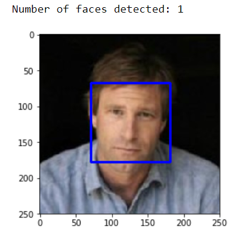
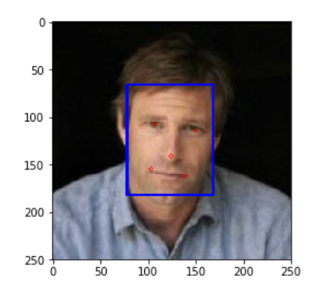
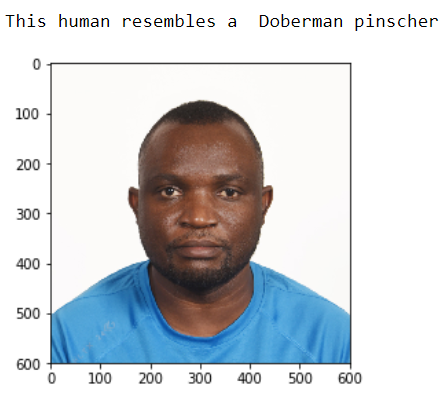
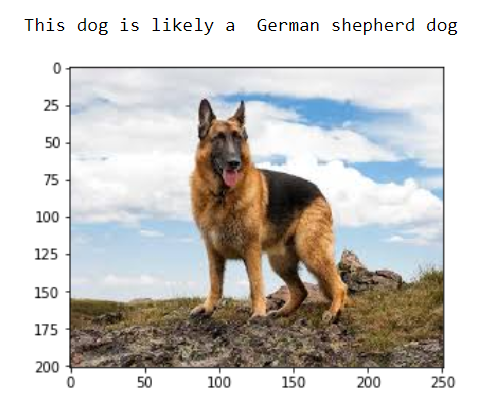

# Dog Identification Algorithm
> 
## Introduction:
This project uses Convolutional Neural Networks (CNN) to build a pipeline that processes real-world user-supplied images of dogs to detect the breed of the dog. Given an image of a dog, the algorithm will identify an estimate of the canine’s breed. If supplied an image of a human, the algorithm will identify the resembling dog breed.

## Table of contents
* [Data and Code](#data-and-code)
* [Phase #1: Face Detection](#phase-1-face-detection)
* [Phase #2: Dog detection using a  pre-trained VGG-16 and ResNet-152 Models](#phase--2--dog-detection-using-a--pre-trained-vgg-16-and-resnet-152-models)
* [Phase #3: Create a CNN to Classify Dog Breeds (from Scratch)](#phase--3--create-a-cnn-to-classify-dog-breeds--from-scratch-)
* [Phase #4: Create a CNN to Classify Dog Breeds (using Transfer Learning)](#phase--4--create-a-cnn-to-classify-dog-breeds--using-transfer-learning-)
* [Final Phase: Dog identification Algorithm](#final-phase--dog-identification-algorithm)
* [Prerequisites](#prerequisites)

## Data and Code
The full training and testing dataset is not included in this repository because of it's huge size. Full links to the dataset are included in the accompanying jupyter notebook. 

In addition to the data files, the project workspace includes:
* **dog_app.ipynb** - jupyter notebook that contains the algorithm.

## Phase #1: Face Detection
The first goal of the project was to assess the performance of a given CascadeClassifier face detector. Given an image of human being, the face detector identifies the face and makes a bounding box around the face.


MTCNN face detector was also used to detect facial features such as eyes, nose and mouth.


Performance of the MTCNN was then compared to the CascadeClassifier face detector. For the given images, the results of the two classifiers are at par.

## Phase #2: Dog detection using a  pre-trained VGG-16 and ResNet-152 Models
The second phase of the project involved using pre-trained VGG-16 and ResNet-152 models to detect the presence of dog in supplied images. 
```
Performance of VGG-16:
Percentage of the images in human_files_short that have a detected dog: 0.0%
Percentage of the images in dog_files_short that have a detected dog: 94.0%

Performance of ResNet-152
Percentage of the images in human_files_short that have a detected dog: 0.0%
Percentage of the images in dog_files_short that have a detected dog: 95.0%

```
## Phase #3: Create a CNN to Classify Dog Breeds (from Scratch)
In Phase 3, a Convolutional Neural Network classier to detect dog breeds was created from scratch using pytorch. The architecture of the built CNN:
```
INPUT => [CONV => RELU => POOL] * 2 => DO => [FC => RELU => DO] * 2 => FC
```
CNN performance was evaluated against an objective of achieving an accuracy score greater than 10%. This performance was achieved:
```
Test Loss: 3.870671
Test Accuracy: 12% (102/836)
```
## Phase #4: Create a CNN to Classify Dog Breeds (using Transfer Learning)
Phase 4 involved the use of Transfer Learning to create a CNN that can identify a dog breed from images. The performance object was to attain at least 60% accuracy on the test set. A pre-trained Densely Connected Convolutional Networks (DenseNet-121) was used. This network achieved the following performance:
```
Test Loss: 0.670123
Test Accuracy: 79% (662/836)
```

## Final Phase: Dog identification Algorithm
In the final phase, I created a dog identification algorithm that accepts a file path to an image and first determines whether the image contains a human, dog, or neither. The algorithm works as follows:
>if a **dog** is detected in the image, the algorithm returns the predicted breed.


>if a **human** is detected in the image, the algorithm returns the resembling dog breed.


>if **neither** is detected in the image, an error message is printed to the user. 

## Prerequisites
* numpy
* glob
* matplotlib
* opencv-python
* mtcnn
* pytorch
* pillow
* os

**Note**: python 3 is needed to run the python scripts.
